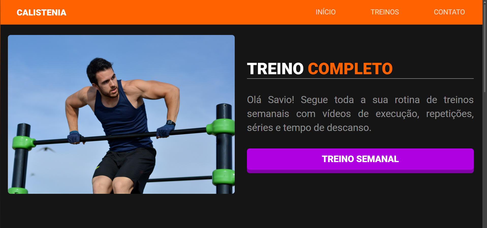

# 🏋️ Calisthenics Workout



Site personalizado de acompanhamento de treinos de calistenia, desenvolvido para organizar e apresentar a rotina semanal de treinos de forma simples e visual.

👉 [Teste clicando aqui 🔗](https://pierry-savio.github.io/calisthenics-workout/#hero)

## 📋 Sobre o Projeto

O **Calisthenics Workout** é uma landing page que exibe a rotina de treinos semanal de um aluno, com vídeos de execução, repetições, séries e tempo de descanso para cada dia da semana.

## ✨ Funcionalidades

- **Menu responsivo**: navegação fixa no desktop e menu mobile retrátil (hambúrguer).
- **Seção Hero**: apresentação inicial com chamada para a rotina de treinos.
- **Rotina semanal**: cards interativos para cada dia da semana (segunda a sábado), com grupos musculares trabalhados.
- **Controle de dias ativos**: dias de treino podem ser marcados como disponíveis ou não através de variáveis no JavaScript, desabilitando visualmente e funcionalmente os dias sem treino cadastrado.
- **Redirecionamento dinâmico**: ao clicar em um dia disponível, o usuário é levado para a página de treino correspondente.
- **Seção de contato**: links diretos para WhatsApp, e-mail e Instagram.
- **Cronômetro**: Cronômetro de tempo de descanso com a funcionalidade de play, pause ou repeat.
- **Vídeos de execução**: Vídeos práticos mostrando como executar cada exercício.

## 🛠️ Tecnologias Utilizadas

- **HTML5** — estruturação semântica do conteúdo
- **SCSS (Sass)** — estilização modular, com uso de variáveis, funções e imports organizados por seção
- **JavaScript (Vanilla)** — interatividade, manipulação do DOM e lógica de exibição dos dias de treino
- **Google Fonts** — fonte Roboto

## ⚙️ Como Funciona o Controle dos Dias

No arquivo `script.js`, cada dia da semana possui uma variável booleana que define se há treino cadastrado:

```javascript
const monday = true;
const thursday = false;
```

- Se `true`, o card do dia fica habilitado visualmente (classe `not-included` é removida) e o clique redireciona para a página do treino.
- Se `false`, o card recebe a classe `not-included`, indicando visualmente que não há treino disponível, e o clique não realiza nenhuma ação.

Isso permite atualizar facilmente a rotina semanal apenas alterando essas variáveis, sem precisar modificar o HTML.

## 🚀 Como Executar Localmente

1. Clone o repositório:
   ```bash
   git clone https://github.com/seu-usuario/calistenia-savio.git
   ```
2. Abra o arquivo `pages/index.html` em seu navegador, ou utilize uma extensão como o **Live Server** (VS Code) para melhor experiência de desenvolvimento.

---

Feito por [@pierry-savio](https://github.com/pierry-savio) para Savio.
